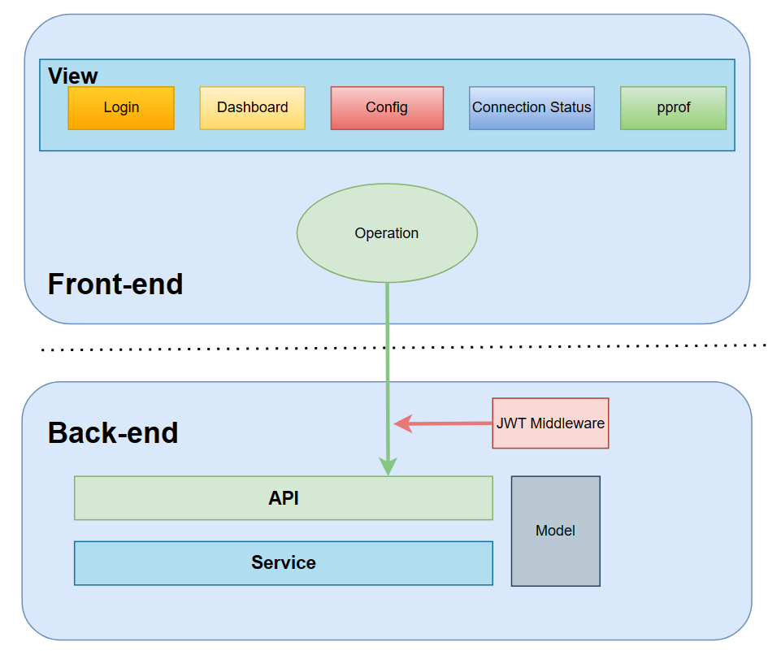
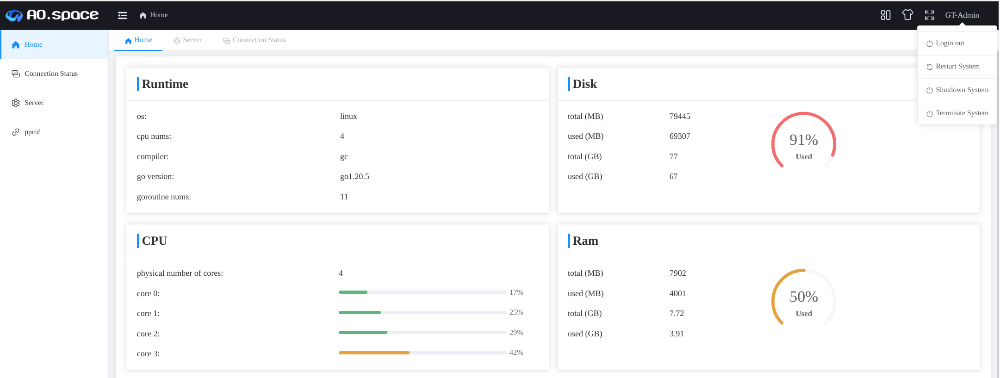
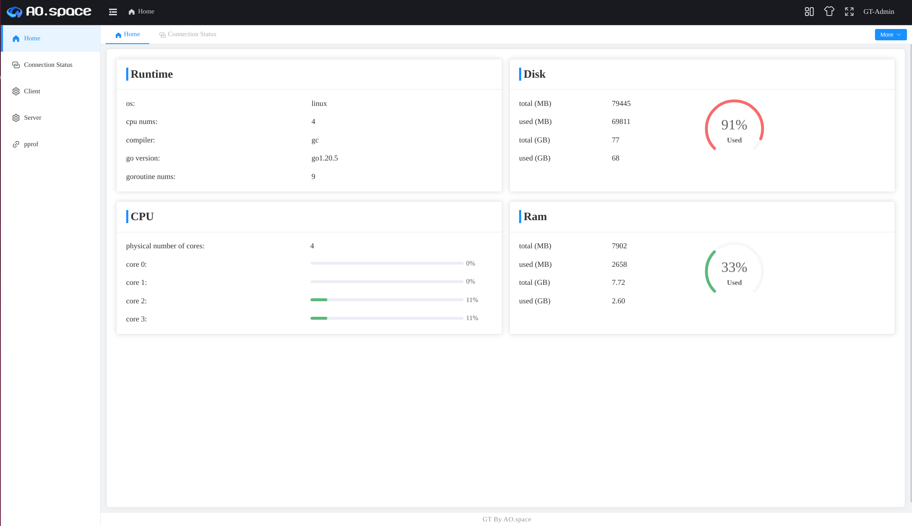
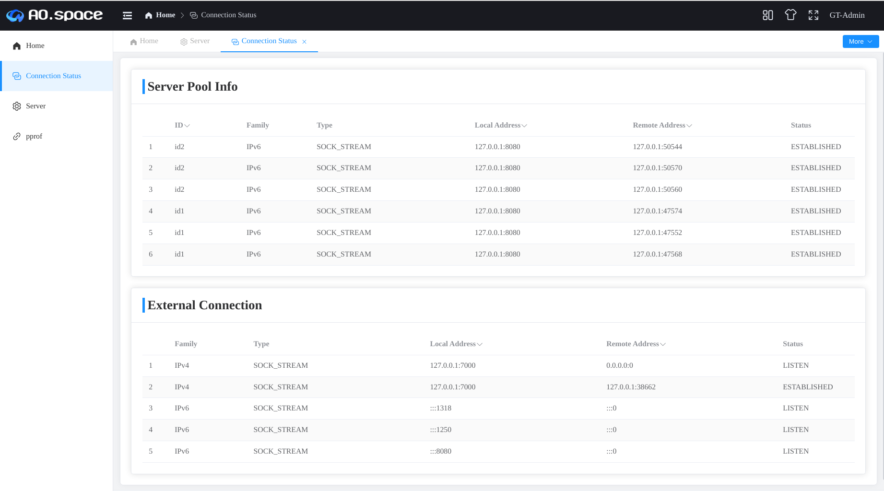
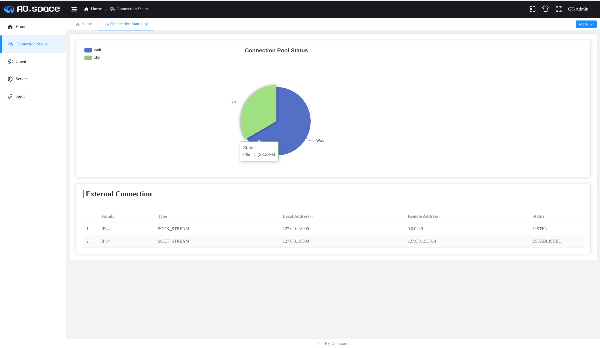
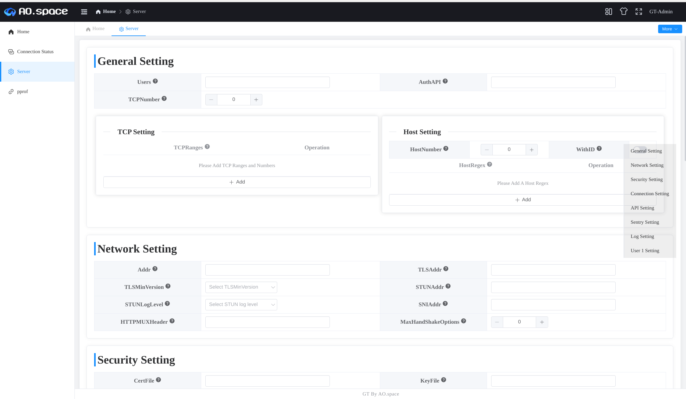
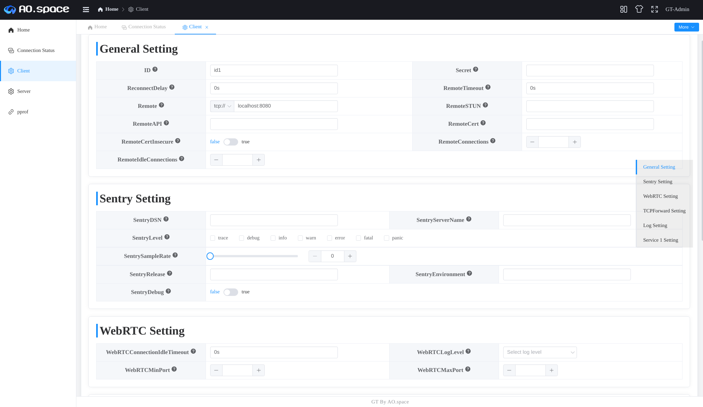
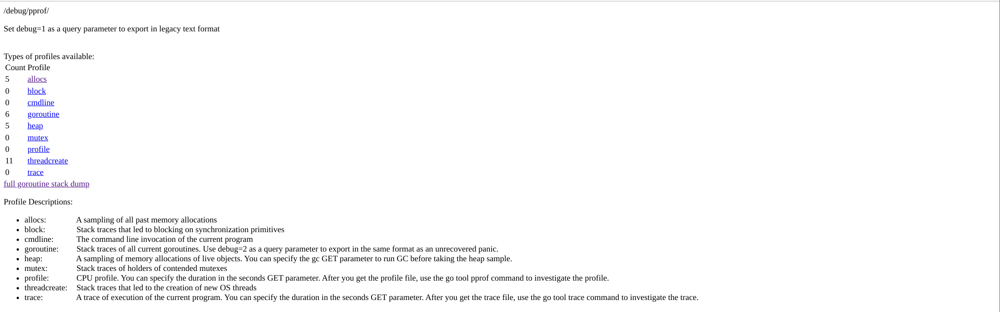
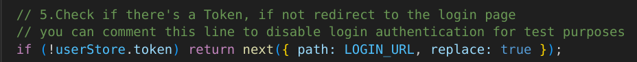

# GT-Admin

[English](README.md) | 简体中文

## 介绍 📖

**GT-Admin** 是一个为 **[GT](https://github.com/ao-space/gt)** 用户专门开发的 Web
界面。它采用了 [Geeker-Admin](https://github.com/HalseySpicy/Geeker-Admin)
的模板，并基于[gin 框架](https://github.com/gin-gonic/gin) 构建。这个界面不仅允许用户在视觉上更直观地进行各种配置操作，还为用户提供了对系统状态的
**可视化监测功能。**

## 目录

- [项目功能](#项目功能)
- [项目结构](#项目结构)
- [安装步骤](#安装步骤)
  - [GT-Server端设置](#gt-server端设置)
  - [GT-Client端设置](#gt-client端设置)
- [Web端使用教程](#web端使用教程)
  - [登录](#登录)
  - [系统控制](#系统控制)
  - [系统状态监测](#系统状态监测)
  - [连接状态查看](#连接状态查看)
  - [配置界面](#配置界面)
  - [pprof界面](#pprof界面)
- [前端开发者设置](#前端开发者设置)

## 项目功能

- 系统状态监测（监测 OS、CPU、Memory、Disk）
- 连接状态查看 (连接池连接、外部连接)
- 配置管理功能 (查看、更改、保存)
- pprof 性能分析

## 项目结构



## 安装步骤

### GT-Server端设置

<details>
    <summary>详细步骤</summary>

1. 获取项目
   ```shell
   git clone https://github.com/huwf5/gt.git
   ```
2. 编译后端项目
   ```shell
   cd gt
   git checkout -b first origin/first   ## 暂时需要
   make release_server # 编译好的文件在release文件夹下
   ```
3. 编译前端项目
   ```shell
   cd web/front
   npm install
   ```
4. 编写 web 配置文件（**Web Setting** 请**详细**配置，其他配置后续可以在 web 中配置,建议**保存**在**release**文件夹中）
   <details>
   <summary>server.yaml</summary>

     ```yaml
   #server.yaml
   options:
   # General Setting (MUST!) :To start the gt-server
   # You can change it later on web page
     addr: 8080

   # Web Setting(Optional)
     # Whether to start the Web Server
     web: true
     #Set Web Addr
     webAddr: localhost
     webPort: 7000
     # Use to sign the jwt token(Validity Period: 6 hour)
     signingKey: signature
     # Use to log in the web page
     admin: server
     password: admin
     # Start the pprof services
     # need 'web' prop set to be true first
     pprof: true #(optional)
     ```

   </details>

5. 启动服务

- 启动后端服务(切换至**release**文件夹)
  ```shell
  # Note you need to change the [] into your real location
  ./linux-amd64-server -config [path/to/server.yaml]   # start gt-server
  ```
- 启动前端服务
  - a. 更改 proxy 设置（先检查下述文件，更改**PROXY**设置为对应的 web 后端 url，与 yaml 配置文件中保持一致，此处为 7000）
    ```ts
    //.env.development
    VITE_PROXY = [["/api", "http://localhost:7000"]];
    ```
  - b. 启动 web 服务
    ```shell
    npm run dev
    ```

</details>

### GT-Client端设置

<details>
    <summary>详细步骤</summary>

1. 获取项目
   ```shell
   git clone https://github.com/huwf5/gt.git
   ```
2. 编译后端项目
   ```shell
   cd gt
   git checkout -b first origin/first   ## 暂时需要
   make release_client # 编译好的文件在release文件夹下
   ```
3. 编译前端项目
   ```shell
   cd web/front
   npm install
   ```
4. 编写 web 配置文件（**Web Setting** 请**详细**配置，其他配置后续可以在 web 中配置,建议**保存**在**release**文件夹中）
   <details>
   <summary>client.yaml</summary>

   ```yaml
   #client.yaml
   options:
     # General Setting (MUST!) :To start the gt-client
     # You can change it later on web page
     id: id1
     remote: tcp://localhost:8080

     # Web Setting (Optional)
     # Whether to start the Web Server
     web: true
     # Set Web Addr
     webAddr: localhost
     webPort: 8000
     # Use to sign the jwt token(Validity Period: 6 hour)
     signingKey: signature
     # Use to log in the web page
     admin: client
     password: admin
     # Start the pprof services
     # need 'web' prop set to be true first
     pprof: true #(optional)
   ```

   </details>

5. 启动服务

- 启动后端服务(切换至**release**文件夹)
  ```shell
  # Note you need to change the [] into your real location
  ./linux-amd64-client -config [path/to/client.yaml]   # start gt-client
  ```
- 启动前端服务
  - a. 更改 proxy 设置（先检查下述文件，更改**PROXY**设置为对应的 web 后端 url，与 yaml 配置文件中保持一致,此处为 8000）
    ```ts
    //.env.development
    VITE_PROXY = [["/api", "http://localhost:8000"]];
    ```
  - b. 启动 web 服务
    ```shell
    npm run dev
    ```

</details>

## Web端使用教程

### 登录

- 使用配置文件中设置的 admin 与 password 进行登录
  

### 系统控制

- 点击右上角的**“GT-Admin”** 后有工具栏

  - **Login out**：清理用户信息并退出
  - **Restart System**：重启整个服务器

  **Note**：下面的操作都会关闭整个系统，后续还需服务需要手动启动，**请谨慎操作**

  - **Shutdown System**：关闭系统
  - **Terminate System**： 中断系统

  

### 系统状态监测

- 提供系统信息、DISK、CPU、RAM 信息查看
  

### 连接状态查看

- Server 端提供连接**信息**查看
  
- Client 端提供连接**状态**查看
  

### 配置界面

- 通用配置修改流程

  1. 初始进入时会提示是否载入配置文件中的信息。
  2. 用户根据自身需要配置有关设置，有关设置的详细信息可以在**"?"**处查看。侧边的导航栏帮助用户高效跳转到相关内容上。
  3. 用户配置完成后点击 **Sumbit** 按钮，将有关的配置信息重写进配置文件中，（若一开始未指定配置文件，则会保存在与 gt-server(
     client)的编译文件同处一个文件夹）
  4. 用户可以多次进行修改有关配置并进行保存。

  - 基本操作（操作栏在最后，可点击侧边最后内容进行跳转）：
    - **GetFromFile：**获取配置文件中的内容，若启动时不是使用`-config` （即没有设置配置文件），那么会执行**GetFromRunning**
      的操作 （**推荐使用`-config` 进行启动服务**，因为后续的 Restart 操作都是重新运行初始的的启动命令，只有初始启用时设置了配置文件路径才可保证后续操作符合用户预期）
    - **GetFromRunning**：获取正在运行着的配置信息。

- gt-server端启用配置

  - **用户保存修改后**，可以通过**Restart System**来进行新配置的启用（该操作会启用一个新的进程）。

  - **General Setting** 处设置的**TCP Setting** 与 **Host Setting** 均是 **全局**设置，**精细化**设置请在下面的**User
    Setting**处设置

- gt-client端启用配置

  - **用户保存修改后**，可以使用**Reload Services**来保持原有进程的同时，重启 Serivces 服务（前提是只更改了
    Services），但是如果更改了 Options 字段的内容（即非 Services 部分内容），则要启用该配置服务就只能通过**Restart System**
    来重启整个进程来实现配置的更改。
    

### pprof界面

- 性能检测界面
  

## 前端开发者设置

- src/api/modules/login.ts 的 getAuthMenuListApi 中注释上面的代码，可以实现无需开启后端得到路由权限

  

- src/routers/index.ts 的 router.beforeEach 函数中可以注释这行代码来实现绕过用户登录，来进行其他界面的跳转以及测试
  

进行上述操作后，即可实现在前端界面开发时，无需开启后端。
